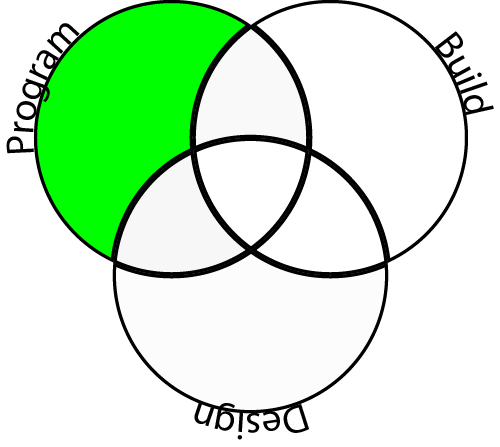
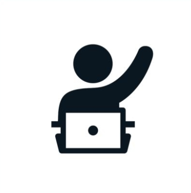

## What you will make

--- no-print ---
In this project you will create a skiing game, guiding the Scratch cat down a ski slope and avoiding obstacles to gain points.

Click on the green flag to start and then use the arrow keys to control the cat.

  <iframe allowtransparency="true" width="485" height="402" src="//scratch.mit.edu/projects/embed/281116583/?autostart=false" frameborder="0" scrolling="no"></iframe>
  

--- /no-print ---

--- print-only ---
In this project you will create a skiing game, guiding the Scratch cat down a ski slope and avoiding obstacles to gain points.

--- /print-only ---

--- collapse ---
---
title: What you will learn
---

[foundation](images/foundation.png)
This is a **Foundation** level project.

<html>

<table class="tg">
  <tr>
    <td class="tg-73oq"></td>
    <td class="tg-73oq">Use random numbers to choose a sprite's position</td>
  </tr>
  <tr>
    <td class="tg-73oq" rowspan="2"></td>
    <td class="tg-73oq">Use sensing blocks to detect when sprites touch each other.</td>
  </tr>
  <tr>
  <td class="tg-73oq">Detect keypresses to change a sprite's `x` and `y` position</td>
  </tr>
  <tr>
    <td class="tg-73oq"></td>
    <td class="tg-73oq">Use random positioning and collision detection on additional sprites</td>
  </tr>
</table>
</html>

--- /collapse ---

--- collapse ---

---
title: What you will need
---

### Hardware

+ A computer capable of running Scratch

### Software

+ Scratch 3 (either [online](http://rpf.io/scratchon){:target="_blank"} or [offline](http://rpf.io/scratchoff){:target="_blank"})

### Downloads

The starter project can be found [here](http://rpf.io/p/en/scratch-cat-goes-skiing-go){:target="_blank"}.

--- /collapse ---

--- collapse ---
---
title: Additional information for educators
---

--- no-print ---

If you need to print this project, please use the [printer-friendly version](https://projects.raspberrypi.org/en/projects/scratch-cat-goes-skiing/print){:target="_blank"}.

--- /no-print ---

You can [find the solution for this project here](http://rpf.io/p/en/scratch-cat-goes-skiing-get){:target="_blank"}.

--- /collapse ---
